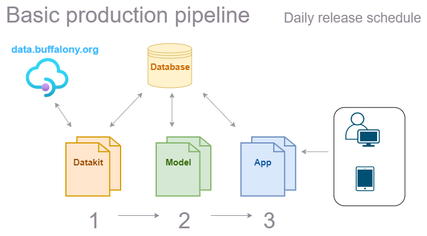

This document serves as a guide for all team members as we start to build out production assets and the production automation pipeline.

### Overview

The following diagram presents a high-level overview of the production automation lifecycle.

Each day, the `datakit` codebase will collect new incidents from the source API and update the database with production data assets. Then, the `dssquad-ml` codebase will retrain the model on fresh data and insert forecasts into the database. Finally, the `dssquad-app` codebase will build and deploy a new version of the Streamlit app using all up-to-date production data assets.

All of this will happen via automation.

### Production requirements for each team

Data Engineering - [Requirements]( "Requirements")

Machine Learning - [Requirements]( "Requirements")

Web application - [Requirements]( "Requirements")

### Automating workflows with GitHub Actions

GitHub Actions will make it easy to automate and orchestrate the execution of code to build and deploy our software. For our purposes, we will use GitHub Actions to trigger the execution of production code sequentially across multiple repositories to automate our daily builds.

GitHub Actions runs "workflows" in response to one or more "events". Common event types to trigger workflows include:

- `schedule` events, i.e. cron expressions run workflows at specific times
- `push` events, i.e. a commit is pushed to the repo and runs the workflow
- `worflow_dispatch`, e.g. the completion of a workflow in one repository triggers the execution of a workflow in another

**Using GitHub Actions for our project**

For our project, we will strive for the following production workflow sequence:

1. The `dssquad-datakit` codebase runs via a `schedule` event at [insert time] each day. 

2. Upon completion, a `worflow_dispatch` event is triggered to run the `dssquad-ml` codebase. 

3. Upon completion, another `worflow_dispatch` event is triggered to run the `dssquad-app` codebase.

