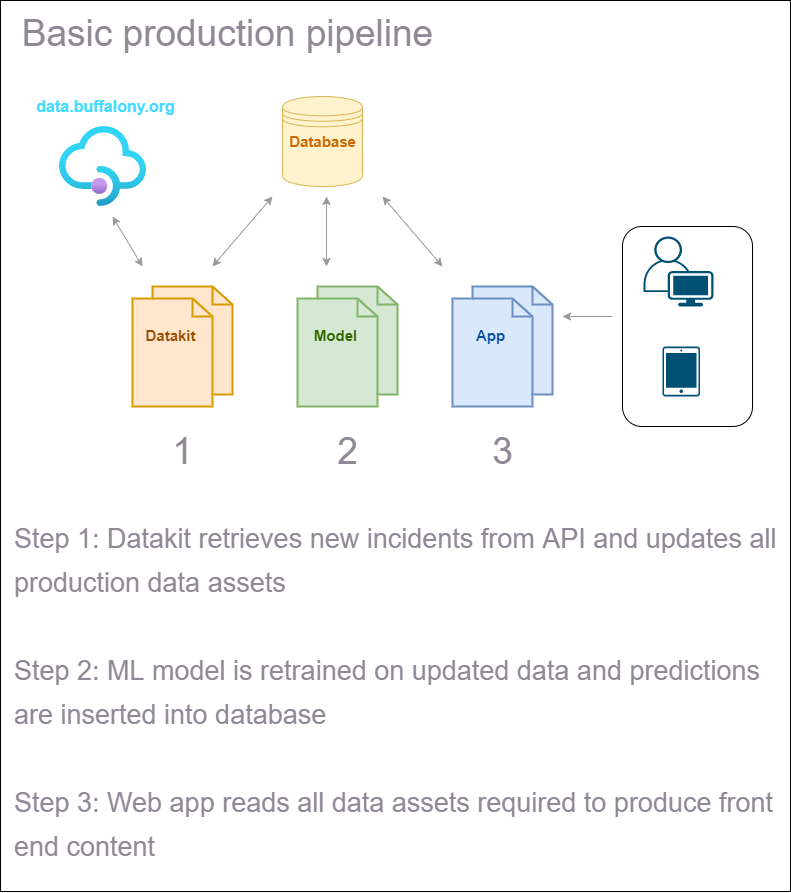

This document serves as a guide for all team members as we start to build out production assets and the production automation pipeline.

This is the current vision for the production automation pipeline:

### Datakit Q&A

**Q: What environment resources will be needed to run the datakit codebase?**

A: The datakit codebase will run on a [physical/virtual] machine. The environment will need Python version 3.X and some third-party libraries including [list of libraries].

**Q: What event will trigger the deployment and execution of the datakit codebase?**

A: The datakit code will run at [insert time] each day.

**Q: Will the datakit codebase need to be deployed to another machine for execution?**

A: If using a physical machine, the code will need to be deployed from the main branch of the GitHub repository to the physical machine using Git. If using a virtual machine, such as GitHub Actions, the code does not need to be deployed to another location.

**Q: How will the datakit codebase be executed?**

A: Shell script

### Machine Learning Q&A

**Q: What environment resources will be needed to run the ML codebase?**

A: The datakit codebase will run on a virtual machine using GitHub Actions. The environment will be configured to use Python version 3.X and some third-party libraries including [list of libraries].

**Q: What event will trigger the deployment and execution of the ML codebase?**

A: The datakit code will run once the datakit has been executed. More details needed...

**Q: Will the ML codebase need to be deployed to another machine for execution?**

A: No, the ML codebase will run on a virtual machine using GitHub Actions.

**Q: How will the datakit codebase be executed?**

A: Using a GitHub Actions workflow configuration file.

### Web Application Q&A

**Q: What environment resources will be needed to run the ML codebase?**

A: The app codebase will run on either Streamlit Sharing or Heroku virtual machine containing Python 3.X and some third-party libraries including [list of libraries].

**Q: What event will trigger the deployment and execution of the ML codebase?**

A: The app code will run once the ML codebase has been executed. More details needed...

**Q: Will the app codebase need to be deployed to another machine for execution?**

A: No, the app codebase will be deployed from GitHub to Streamlit/Heroku using fully managed services provided by Streamlit/Heroku.

**Q: How will the app codebase be executed?**

A: Using fully managed services provided by Streamlit/Heroku.

